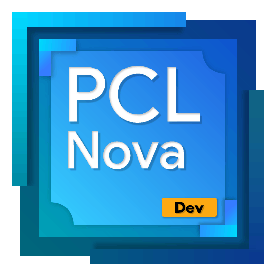

# PCL II Nova：下一代 PCL 启动器

基于官方版 PCL2 的完全重构\
采用 Web 技术（Vue，TypeScript）和内存安全的 Rust 全新构建\
这，就是 PCL II Nova！

第一个可用（功能有限）发行版计划于 2025.4 之前推出\
在此之前你可以自行下载代码编译运行\
请确保安装 Node 18+ 和 Rust 1.85.0+\
Clone 到本地之后运行 `pnpm i` 和 `pnpm tauri build` 即可编译

加入 PCL II Nova 交流 1 群，与开发者面对面交流，获取\
最新资讯：https://qm.qq.com/q/nwBlYWMhHM
